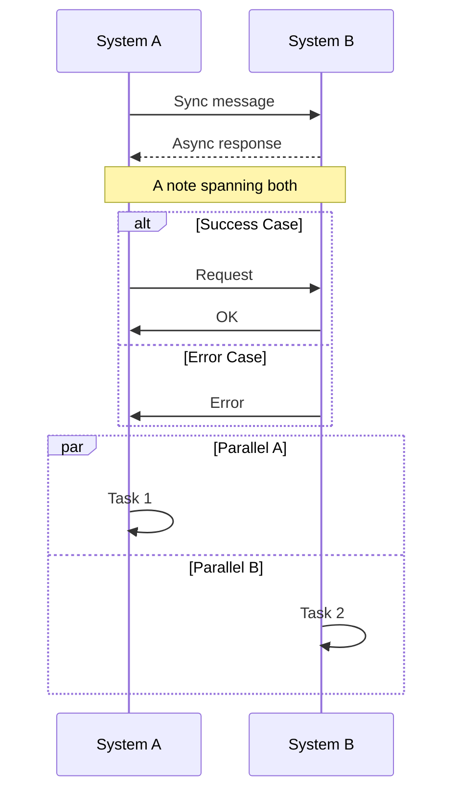
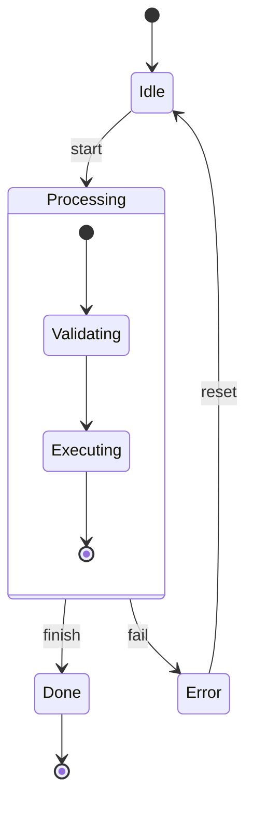
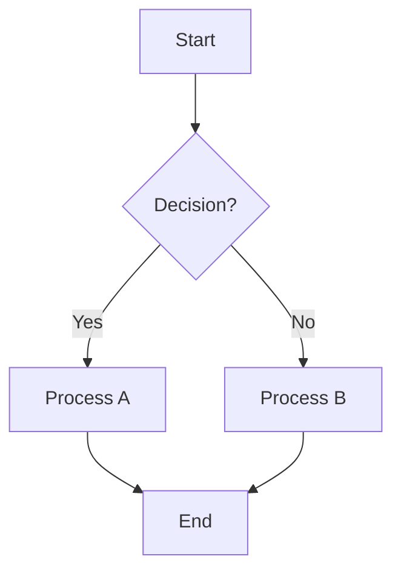
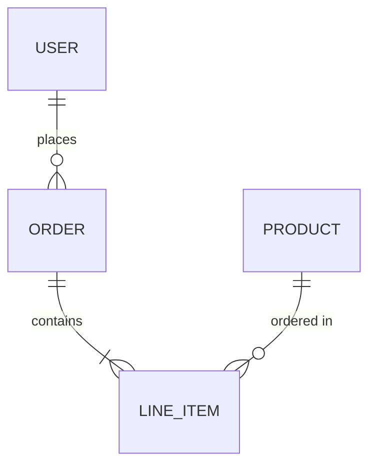

# Diagram Designer (Draw.io + Mermaid)

根据图表类型自动选择最佳格式：
- **流程图、架构图、ER 图、泳道图** → `.drawio` XML（布局灵活，手动微调方便）
- **时序图、状态图** → `.mermaid`（语法简洁，渲染精准，天然支持 lifeline/alt/par）
- 用户明确指定格式时按用户要求

## When to Use This Skill

激活条件 — 用户请求包含以下任一关键词或意图：
- 画流程图、架构图、时序图、ER 图、状态图、泳道图、网络拓扑图
- 生成 drawio / diagrams.net / mermaid 格式文件
- 用图形表示业务流程、系统架构、数据关系、交互序列

## Format Selection

| 图类型 | 默认格式 | 理由 | 可选格式 |
|--------|---------|------|---------|
| 流程图 | `.drawio` | 节点多样，布局灵活 | `.mermaid` (graph TD/LR) |
| 架构图 | `.drawio` | 形状丰富，分层自由 | — |
| 时序图 | `.mermaid` | 语法简洁，原生 lifeline/par/alt | `.drawio` (umlLifeline，繁琐) |
| ER 图 | `.drawio` | swimlane 实体表直观 | `.mermaid` (erDiagram) |
| 状态图 | `.mermaid` | stateDiagram 语法清晰 | `.drawio` |
| 泳道图 | `.drawio` | swimlane 可视化好 | — |

## Core Workflow

### Step 0: 选择格式
根据"格式选择"表确定输出 `.drawio` 还是 `.mermaid`。后续 Step 1-5 仅适用于 `.drawio`；Mermaid 跳转到 [Mermaid 语法参考](#mermaid-syntax-reference)。

### Step 1: 分析需求 (drawio)
确定图的类型、节点列表、节点之间的关系、用户是否有特定偏好（方向、颜色、输出路径）。

### Step 2: 规划布局 (drawio)
**默认布局**: 流程图自上而下(Top→Down)，架构图从左到右(Left→Right)。
**坐标规则**: gridSize=10，所有坐标为 10 的整数倍。直接在心智内按公式计算。

**布局参数**:
| 参数 | 默认值 | 说明 |
|------|--------|------|
| 节点宽度 | 120px | 矩形节点，菱形取140px |
| 节点高度 | 60px | 矩形节点，菱形取80px |
| 垂直间距 | 60px | 自上而下布局的节点间距 |
| 水平间距 | 80px | 从左到右布局的节点间距 |
| Canvas 起始 | x=40, y=40 | 画布边距 |

### Step 3: 选择样式 (drawio)
根据节点角色匹配颜色和形状 (详情见 `references/shapes.md` 和 `references/colors.md`):
- 开始/结束 → 绿色椭圆 `ellipse;fillColor=#d5e8d4;strokeColor=#82b366`
- 处理步骤 → 蓝色矩形 `fillColor=#dae8fc;strokeColor=#6c8ebf`
- 判断分支 → 黄色菱形 `rhombus;fillColor=#fff2cc;strokeColor=#d6b656`
- 数据I/O → 紫色平行四边形 `shape=parallelogram;fillColor=#e1d5e7`
- 错误处理 → 红色矩形 `fillColor=#f8cecc;strokeColor=#b85450`

### Step 4: 生成 XML (drawio)
输出完整 .drawio 文件。模板框架如下，必须包含 `mxCell id="0"` (根节点) 和 `mxCell id="1" parent="0"` (默认图层)：

```xml
<?xml version="1.0" encoding="UTF-8"?>
<mxfile host="app.diagrams.net" agent="OpenCode Draw.io Skill" version="21.0.0">
  <diagram id="diagram-1" name="Page-1">
    <mxGraphModel dx="1422" dy="762" grid="1" gridSize="10" guides="1" tooltips="1" 
                   connect="1" arrows="1" fold="1" page="1" pageScale="1" 
                   pageWidth="1169" pageHeight="827" math="0" shadow="0">
      <root>
        <mxCell id="0" />
        <mxCell id="1" parent="0" />
        <!-- 节点和边放这里 -->
      </root>
    </mxGraphModel>
  </diagram>
</mxfile>
```

### Step 5: 验证 (drawio Pre-Write Checklist)

在写入文件之前，对生成的 XML 执行以下逐项检查：

| # | 检查项 | 方法 | 常见失败 |
|---|--------|------|---------|
| 1 | **XML 注释不含 `--`** | 搜索 `<!--` ... `-->` 内是否出现 `--` | `size--` → 改为 `size decrement` |
| 2 | **坐标均为 10 的倍数** | 所有 `<mxGeometry>` 的 x/y 值 `% 10 == 0` | 坐标以 5 结尾 → 四舍五入到最近 10 倍数 |
| 3 | **边 source/target 存在** | 每页内收集所有 id，核对每条边的引用 | 拼写错误、跨页引用 |
| 4 | **每页有 mxCell id="0" 和 id="1"** | 每个 `<diagram>` 内前两个 `<mxCell>` | 遗漏导致页面空白 |
| 5 | **所有节点/边有 parent** | 无 `parent` 属性的顶点/边会丢失 | 直接在 root 下创建 |
| 6 | **泳道子节点 parent 正确** | 子节点 `parent="swim1"` 而非 `parent="1"` | 子节点未嵌套在泳道内 |
| 7 | **value 属性无裸 `<` `>` `&`** | 用 `&lt;` `&gt;` `&amp;` 转义 | `cmp < 0` → `cmp &lt; 0` |
| 8 | **文件仅通过 `write` 工具输出** | 不经过 PowerShell `Set-Content` 等工具 | UTF-8 字符被破坏为 `\ufffd` |

**🚫 不要后处理**：生成后不要用脚本修改文件（坐标修正、文本替换等），应在生成时一次性正确。PowerShell `Set-Content` 会破坏 UTF-8 多字节字符。

---

## XML Template Reference

### 节点 (Vertex)

```xml
<mxCell id="UNIQUE_ID" value="显示文字" style="SHAPE_STYLE" vertex="1" parent="1">
  <mxGeometry x="X" y="Y" width="W" height="H" as="geometry"/>
</mxCell>
```

- `value` 支持 HTML 标签 (`<b>粗体</b>`, `<br>` 换行) 和 `&#xa;` 换行
- `style` 多个属性用 `;` 分隔
- 多行文本: style 末尾添加 `overflow=fill;`

### 连线 (Edge)

```xml
<mxCell id="EDGE_ID" value="标签" style="EDGE_STYLE" edge="1" parent="1" source="FROM_ID" target="TO_ID">
  <mxGeometry relative="1" as="geometry"/>
</mxCell>
```

**连线方向控制 (正交线)**:
| 方向 | exitX | exitY | entryX | entryY |
|------|-------|-------|--------|--------|
| 上→下 | 0.5 | 1 | 0.5 | 0 |
| 左→右 | 1 | 0.5 | 0 | 0.5 |
| 判断:是 | 1 | 0.5 | — | — |
| 判断:否 | 0.5 | 1 | — | — |

**基础边样式**:
- 正交线 (推荐): `edgeStyle=orthogonalEdgeStyle;rounded=0;orthogonalLoop=1;jettySize=auto;html=1;exitX=0.5;exitY=1;entryX=0.5;entryY=0;`
- 带标签: 在上述基础上添加 `;labelBackgroundColor=#ffffff;` + 设置 `value="标签文字"`
- 虚线: 添加 `dashed=1`
- 双向箭头: 添加 `startArrow=classic`

---

## Quick Examples

### 最小流程图 (3 节点)

```xml
<?xml version="1.0" encoding="UTF-8"?>
<mxfile host="app.diagrams.net" agent="OpenCode Draw.io Skill" version="21.0.0">
  <diagram id="diagram-1" name="Page-1">
    <mxGraphModel dx="1422" dy="762" grid="1" gridSize="10" guides="1" tooltips="1" connect="1" arrows="1" fold="1" page="1" pageScale="1" pageWidth="827" pageHeight="1169" math="0" shadow="0">
      <root>
        <mxCell id="0" />
        <mxCell id="1" parent="0" />
        <mxCell id="2" value="开始" style="ellipse;whiteSpace=wrap;html=1;fillColor=#d5e8d4;strokeColor=#82b366;" vertex="1" parent="1">
          <mxGeometry x="340" y="40" width="120" height="60" as="geometry"/>
        </mxCell>
        <mxCell id="3" value="处理步骤" style="whiteSpace=wrap;html=1;fillColor=#dae8fc;strokeColor=#6c8ebf;" vertex="1" parent="1">
          <mxGeometry x="340" y="160" width="120" height="60" as="geometry"/>
        </mxCell>
        <mxCell id="4" value="结束" style="ellipse;whiteSpace=wrap;html=1;fillColor=#d5e8d4;strokeColor=#82b366;" vertex="1" parent="1">
          <mxGeometry x="340" y="280" width="120" height="60" as="geometry"/>
        </mxCell>
        <mxCell id="101" value="" style="edgeStyle=orthogonalEdgeStyle;rounded=0;orthogonalLoop=1;jettySize=auto;html=1;exitX=0.5;exitY=1;entryX=0.5;entryY=0;" edge="1" parent="1" source="2" target="3">
          <mxGeometry relative="1" as="geometry"/>
        </mxCell>
        <mxCell id="102" value="" style="edgeStyle=orthogonalEdgeStyle;rounded=0;orthogonalLoop=1;jettySize=auto;html=1;exitX=0.5;exitY=1;entryX=0.5;entryY=0;" edge="1" parent="1" source="3" target="4">
          <mxGeometry relative="1" as="geometry"/>
        </mxCell>
      </root>
    </mxGraphModel>
  </diagram>
</mxfile>
```

完整 .drawio 示例（登录流程 10节点、微服务架构 6服务、ER图 3表）见 `references/examples.md`。形状和颜色速查表见 `references/shapes.md` 和 `references/colors.md`（均仅限 drawio）。

---

## Mermaid Syntax Reference

Mermaid 文件是纯文本，无 XML 编码陷阱，直接 `write` 即可。

### 时序图 (sequenceDiagram)



**关键语法规则**（真实踩坑总结）：

| 规则 | ❌ 错误 | ✅ 正确 |
|------|--------|--------|
| `par` 标签不含 `and` 关键字 | `par A and B Processing` | `par A Processing` |
| `par` 分支用 `and` 分隔 | 三个 `rect` 无 `and` | `par...and...end` |
| 顺序逻辑不放 `par` 内 | `par` 内含 blocking wait | 移出 `par`，在 `end` 后顺序执行 |
| `alt` 需要 `end` 闭合 | 缺 `end` | `alt...else...end` |
| 参与者名不含空格 | `participant A B` | `participant AB` 或用 `as`: `A as System A` |

### 状态图 (stateDiagram-v2)



### 流程图 (graph/flowchart)



形状语法：`A[矩形]` `B(圆角)` `C([椭圆])` `D{菱形}` `E[[子程序]]` `F[(数据库)]`

### ER 图 (erDiagram) — 仅简单场景



> 复杂 ER 图建议用 `.drawio`（字段列表、PK/FK 标注更清晰）。

---

## Draw.io / Mermaid 图表类型速查

| 类型 | 推荐格式 | 关键元素 | 布局 |
|------|---------|---------|------|
| **流程图** | `.drawio` | 椭圆(始/终), 矩形(处理), 菱形(判断) | 自上而下 |
| **架构图** | `.drawio` | 圆角矩形(服务), 六边形(网关), 圆柱体(DB) | 从左到右分层 |
| **时序图** | `.mermaid` | `participant`, `->>` , `par`/`alt`/`Note` | 自动布局 |
| **ER 图** | `.drawio` | `swimlane`(实体表), 基数标注(1/N) | 自由排列 |
| **状态图** | `.mermaid` | `stateDiagram-v2`, `[*]` , 嵌套 state | 自动布局 |
| **泳道图** | `.drawio` | `swimlane`(泳道容器) | 分区布局 |

完整 shape/color 参考 → `references/shapes.md` `references/colors.md`

---

## Reference Files

详细内容按需加载：

| 文件 | 内容 | 何时加载 |
|------|------|---------|
| `references/shapes.md` | 全部 shape 样式表 + 连线样式表 (drawio only) | 查具体 shape 的 style 字符串 |
| `references/colors.md` | 颜色方案 + 角色颜色映射 (drawio only) | 自定义配色或非标准图表 |
| `references/examples.md` | 完整可运行的 .drawio XML 示例 (drawio only) | 参考 .drawio 完整示例结构 |

---

## Constraints

### MUST DO
- 确保 `<mxCell id="0" />` (根) 和 `<mxCell id="1" parent="0" />` (图层) 始终存在
- 所有节点和边 `parent="1"` (泳道内节点 parent 指向泳道 id)
- 边 `source`/`target` 引用真实存在的节点 id
- 所有 `id` 唯一: 节点从 2 开始，边从 100 开始
- 坐标使用 gridSize=10 的整数倍
- 输出完整 `.drawio` 文件 (含 XML 声明和 mxfile 包装)
- 生成后提示用户用 Draw.io 桌面版或 https://app.diagrams.net 打开

### MUST NOT DO
- **不要在 XML 注释中使用 `--`** — 这会使 XML 解析失败。用文字替代（如 `size decrement` 代替 `size--`）
- **不要让 `source`/`target` 指向不存在的 id** — 每页 id 独立，不可跨页引用
- **不要遗漏 `as="geometry"` 属性** — 缺少会导致节点位置丢失
- **不要使用非 10 倍数的坐标** — 坐标必须与 gridSize=10 对齐
- **不要用 `&#xa;` 作为唯一换行方式** — value 支持 `<br>` HTML 标签，且 `&#xa;` 在某些解析器中不稳定
- **不要使用不存在的 shape 名称** — 参考 `references/shapes.md` 确认
- **🚫 不要用 PowerShell 后处理文件** — `Set-Content` 会损坏 UTF-8 多字节字符（中文等），改为 `\ufffd` 乱码。如需修改，用 `write` 工具直接重写整个文件
- **不要在有中文内容的文件中混合使用多种编辑工具** — 坚持用 `write` 工具做最终输出，避免编码转换

---

## Mermaid Constraints

### MUST DO
- 所有块语法 (`par`, `alt`, `loop`, `opt`, `rect`) 必须有对应的 `end`
- `par` 用独立的 `and` 行分隔并行分支（不要把 `and` 写在标签文字里）
- 顺序逻辑放在 `par` 的 `end` 之后，不要放在 `par` 内部
- `participant` 别名用 `as` 关键字：`participant A as System A`
- 箭头类型明确：`->>` 同步、`-->>` 异步、`-->>` 虚线返回
- 使用 `rect rgb(R, G, B)` 分组时，确保 `end` 闭合

### MUST NOT DO
- **不要将 `and` 关键字作为 `par` 标签的一部分** — `par A and B` 会导致解析歧义
- **不要在 `par` 块中放入 3 个以上分支且不写 `and`** — Mermaid `par` 只支持 `par` + `and` 两个分支
- **不要在 `par` 内放置依赖另一个分支结果的顺序逻辑** — 如 `Wait mt done flag` 应在 `par/end` 之后
- **不要遗漏 `end`** — 每个 `par`/`alt`/`loop`/`opt`/`rect` 都必须闭合
- **不要用 `.mermaid` 文件作为 draw.io 输入** — draw.io 期望 XML，Mermaid 用 [mermaid.live](https://mermaid.live) 或插件渲染

---

## Mermaid Troubleshooting

| 症状 | 根因 | 修复 |
|------|------|------|
| 时序图 `par` 块渲染为单列 | `par` 标签内把 `and` 当文本：`par A and B` | 拆为两行：`par A` + 下一行 `and B` |
| BSB 在 MT 完成前执行后续 | 顺序逻辑（blocking wait）放在 `par` 内部 | 移出 `par`，在 `end` 后执行 |
| `par` 内第三块不渲染 | Mermaid `par` 最多 `par`+`and` 两个分支 | 拆为嵌套 `par` 或移为顺序 |
| `alt` 块不闭合导致后面全乱 | 缺 `end` | 补上 `end` |
| GitHub 渲染空白 | 首行不是 `sequenceDiagram` 或缩进用 tab | 首行 `sequenceDiagram`，4 空格缩进 |

---

## Draw.io Troubleshooting

### P0 — 文件无法打开

| 症状 | 根因 | 修复 |
|------|------|------|
| "非绘图文件 (error on line N: Comment must not contain '--')" | XML 注释内出现双连字符，如 `<!-- free → size-- → ... -->` | 用文字替代符号：`size decrement`、`counter minus 1` |
| "非绘图文件 (error on line N: attributes construct error)" | value 属性中包含未转义的 `<` 或 `>`，如 `value="cmp < 0"`。或 UTF-8 字符被破坏导致属性解析失败 | 始终使用 `&lt;` / `&gt;`。代码中的比较运算符必须转义 |
| 文件打开后中文全部乱码 `�` (U+FFFD) | 文件经过非 UTF-8 安全的工具处理（如 PowerShell `Set-Content`）或编码转换 | **只用 `write` 工具生成最终文件**。避免 Shell 文本操作。若必须含中文，生成后立即用 draw.io 验证 |

### P1 — 图表显示异常

| 症状 | 根因 | 修复 |
|------|------|------|
| 边不显示或无箭头 | 缺少 `endArrow=classic;` 或边样式不完整 | 使用正交线模板（含 `endArrow`） |
| 节点重叠或间距不对 | 坐标不是 10 的倍数，导致 grid 对齐失效 | 预计算所有坐标，确保 `x % 10 == 0 && y % 10 == 0` |
| 泳道内节点跑出泳道 | 子节点 `parent="1"` 而非 `parent="泳道id"` | 泳道内节点的 parent 必须指向泳道 `<mxCell>` 的 id |
| 跨页边消失 | 边引用另一页的节点 id | 每页 id 独立，边的 source/target 必须在同一页 |

### P2 — 编码问题

| 症状 | 根因 | 修复 |
|------|------|------|
| 中文标签变成 `?` 或乱码 | 文件编码从 UTF-8 被转换为 ANSI/ASCII | 用 `write` 工具写入，确认声明为 `<?xml version="1.0" encoding="UTF-8"?>` |
| 边标签 (是/否) 显示为乱码 | 与上述相同 | **推荐使用英文标签**（Yes/No）避免一切编码问题。draw.io 本身支持中文，但文件传输路径中的工具可能破坏编码 |
| `&lt;br&gt;` 显示为原始文本 | `value` 的 style 中缺少 `html=1;` | 确保所有需要 HTML 渲染的节点 style 包含 `html=1;` |

### P3 — 常见疏忽

| 问题 | 说明 |
|------|------|
| 节点 id 从非 2 开始 | `id="0"` 和 `id="1"` 是系统保留，始终从 `id="2"` 开始分配 |
| 边 id 与节点 id 冲突 | 建议: 节点 `2..99`, 边 `100..999`，避免混淆 |
| `<mxGeometry>` 缺少 `as="geometry"` | draw.io 依靠此属性识别几何数据，缺失则节点位置被忽略 |
| 多页文件每页的 `<mxCell id="0"/>` 和 `<mxCell id="1"/>` 重复 | 这是正确的 — draw.io 每页有独立 ID 空间，不是错误 |

---

## Pre-Write Self-Check

生成 .drawio 文件后、交付用户前，自问：

```
□ 所有 mxGeometry 坐标是 10 的倍数？（检查 x=385→390, y=155→160 等）
□ XML 注释中没有 --？（搜索 <!-- 和 --> 之间的内容）
□ value 属性中的 < > & 已转义？（< → &lt;, > → &gt;, & → &amp;）
□ 每个 diagram 有 mxCell id="0" 和 id="1"？
□ 泳道内节点的 parent 指向泳道 id 而非 "1"？
□ 文件是直接通过 write 工具生成的，未经过 Shell 后处理？
□ 如含中文，已确认编码为 UTF-8？（或用英文字符避免风险）
```

---

### Mermaid Pre-Write Self-Check

生成 `.mermaid` 文件后、交付用户前，自问：

```
□ 首行是 diagram 类型声明？（sequenceDiagram / stateDiagram-v2 / graph TD）
□ 所有 par/alt/loop/opt/rect 都有对应的 end？
□ par 分支用 and 分隔（独立行），不是写在标签文字里？
□ 顺序逻辑不在 par 内部？（blocking wait 等依赖另一分支结果的操作）
□ participant 别名用了 as？（participant UFC as UFS Cmd Process）
□ 块内缩进统一（4 空格）？
□ 箭头语法正确？（->> 同步, -->> 异步虚线, ->> 实线）
□ 没有将 .mermaid 文件误当作 draw.io 输入？
```

---

## Layout Reference (drawio only)

心灵公式即可，无需调用脚本：

```
自上而下: x = canvas_w/2 - node_w/2,  y[i] = start_y + i*(node_h + gap)
从左到右: x[i] = start_x + i*(node_w + gap), y = canvas_h/2 - node_h/2
多列网格: x = start_x + col*(node_w + gap_x), y = start_y + row*(node_h + gap_y)
节点宽高: 矩形 120×60, 菱形 140×80, 间距 60px
