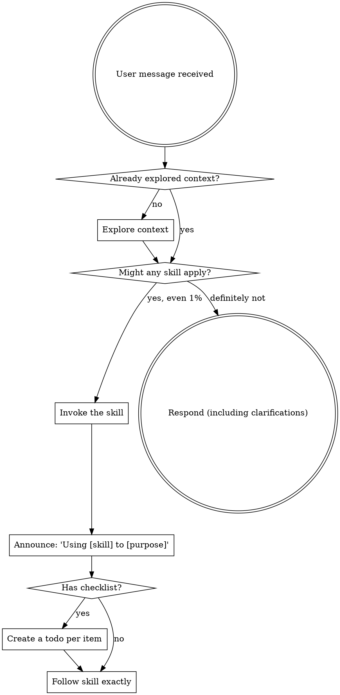

> **嵌入式适配**：本文档中的示例命令已从 Web/Node.js 风格替换为嵌入式 C 等价命令。


<SUBAGENT-STOP>
If you were dispatched as a subagent to execute a specific task, skip this skill.
</SUBAGENT-STOP>

<EXTREMELY-IMPORTANT>
If you think there is even a 1% chance a skill might apply to what you are doing, you ABSOLUTELY MUST invoke the skill.

IF A SKILL APPLIES TO YOUR TASK, YOU DO NOT HAVE A CHOICE. YOU MUST USE IT.

This is not negotiable. This is not optional. You cannot rationalize your way out of this.
</EXTREMELY-IMPORTANT>

## PROJECT-SPECIFIC (AI_Copilot_UFS / SSD firmware)

> 本节为 AI_Copilot_UFS 项目（位于 `AGENTS.md` 描述的 OpenCode Agent 运行时）专属。本 skill 的通用规则仍适用，本节叠加项目级强制要求。**per `docs/retrospectives/2026-06-add-crt-mapping-cache.md` AP-002**。

### 会话开始时必读

加载本 skill 后，**第一步**必读 5 个项目级 memory 文件（按以下顺序）：

1. `.opencode/memory/architecture.md` — 架构分层（NVMe / FTL / NAND 三层 + 横向规则）
2. `.opencode/memory/design_rules.md` — 设计规则（含本 skill 之后加载的 §设计-实现一致性 段）
3. `.opencode/memory/coding_style.md` — 命名 / 注释 / 文件组织
4. `.opencode/memory/concurrency_rules.md` — 锁 / 中断 / 原子操作
5. `.opencode/memory/testing_rules.md` — 测试要求（含 §4.4 Bug Injection Evidence 强制要求）

读完后简短回答（在第一次响应中）：

```
Project context loaded:
- Architecture: <一句话>
- Design rules: <N> rules, including <关键规则名>
- Coding style: <命名约定 + 文件规则>
- Concurrency: <FTL 单线程 / 中断安全 / 锁层级>
- Testing: <覆盖率阈值 + bug injection 强制>
```

> **为什么**：这些规则在 PLAN/DESIGN/BUILD 阶段持续生效；不读会导致 DESIGN 违反 memory 规则（命名 / 风格 / 并发模型）而到 BUILD 阶段才发现。**AP-002 案例**：`add-crt-mapping-cache` 在 PLAN 阶段就违反 coding_style 的"英文命名 + 中文注释"约定，是 session 中段才纠正的。

### 加载完 memory 后必做的 4 步

```bash
# 1. 项目级 OpenCode 配置就绪
bash scripts/verify.sh                 # 17/17 通过

# 2. 知识图谱最新
cd /home/zsf/AI_Proj/femu/hw/femu  # 或目标代码库根
graphify update .

# 3. 4 步 CodeGraph 导航（per sd-firmware-copilot §KNOW）
graphify query "<概念关键词>"      # 概念发现
codegraph where <symbol>          # 精确调用方
codegraph context <func>           # 函数定义 + 复杂度
codegraph impact <file>            # blast radius

# 4. 读 OpenSpec 活跃变更状态（如有）
cd /home/zsf/AI_Proj/AI_Copilot_UFS
openspec list --json
```

> **缺一不可**。4 步未跑就直接进 PLAN 阶段 = AP-001 反模式。

### 项目级强制产物

任何 OpenSpec 变更在 archive 前必须存在：

1. `openspec/changes/<id>/verify-report.md` — 6-check gate + bug injection 覆盖率
2. `openspec/changes/<id>/review.md` — 人工审查记录 + 签字

`openspec-archive-change/SKILL.md` 会**强校验**这两个文件存在（per M-3 修订）。

### 不再赘述（避免循环引用）

- OpenSpec 5 阶段流程：见 `openspec-workflow/SKILL.md`
- SSD 固件 KNOW/BUILD/FEEDBACK 阶段：见 `sd-firmware-copilot/SKILL.md`
- 4 Iron Rules + Bootstrap 决策表：见原 skill 后续内容


## Instruction Priority

Superpowers skills override default system prompt behavior, but **user instructions always take precedence**:

1. **User's explicit instructions** (CLAUDE.md, GEMINI.md, AGENTS.md, direct requests) — highest priority
2. **Superpowers skills** — override default system behavior where they conflict
3. **Default system prompt** — lowest priority

If CLAUDE.md, GEMINI.md, or AGENTS.md says "don't use TDD" and a skill says "always use TDD," follow the user's instructions. The user is in control.

## How to Access Skills

**Never read skill files manually with file tools** — always use your platform's skill-loading mechanism so the skill is properly activated.

**In Claude Code:** Use the `Skill` tool. When you invoke a skill, its content is loaded and presented to you — follow it directly.

**In Codex:** Skills load natively. Follow the instructions presented when a skill activates.

**In Copilot CLI:** Use the `skill` tool. Skills are auto-discovered from installed plugins.

**In Gemini CLI:** Skills activate via the `activate_skill` tool. Gemini loads skill metadata at session start and activates the full content on demand.

**In other environments:** Check your platform's documentation for how skills are loaded.

## Platform Adaptation

Skills speak in actions ("dispatch a subagent", "create a todo", "read a file") rather than naming any one runtime's tools. For per-platform tool equivalents and instructions-file conventions, see [claude-code-tools.md](references/claude-code-tools.md), [codex-tools.md](references/codex-tools.md), [copilot-tools.md](references/copilot-tools.md), [gemini-tools.md](references/gemini-tools.md), [pi-tools.md](references/pi-tools.md), and [antigravity-tools.md](references/antigravity-tools.md). Gemini CLI users get the tool mapping loaded automatically via GEMINI.md.

# Using Skills

## The Rule

**Invoke relevant or requested skills BEFORE any response or action.** Even a 1% chance a skill might apply means that you should invoke the skill to check. If an invoked skill turns out to be wrong for the situation, you don't need to use it.



## Red Flags

These thoughts mean STOP—you're rationalizing:

| Thought | Reality |
|---------|---------|
| "This is just a simple question" | Questions are tasks. Check for skills. |
| "I need more context first" | Skill check comes BEFORE clarifying questions. |
| "Let me explore the codebase first" | Skills tell you HOW to explore. Check first. |
| "I can check git/files quickly" | Files lack conversation context. Check for skills. |
| "Let me gather information first" | Skills tell you HOW to gather information. |
| "This doesn't need a formal skill" | If a skill exists, use it. |
| "I remember this skill" | Skills evolve. Read current version. |
| "This doesn't count as a task" | Action = task. Check for skills. |
| "The skill is overkill" | Simple things become complex. Use it. |
| "I'll just do this one thing first" | Check BEFORE doing anything. |
| "This feels productive" | Undisciplined action wastes time. Skills prevent this. |
| "I know what that means" | Knowing the concept ≠ using the skill. Invoke it. |

## Skill Priority

When multiple skills could apply, use this order:

1. **Process skills first** (systematic-debugging, openspec-workflow) - these determine HOW to approach the task
2. **Implementation skills second** - these guide execution

"Let's build X" → openspec-propose / openspec-explore first, then implementation skills.
"Fix this bug" → systematic-debugging first, then domain-specific skills.

## Skill Types

**Rigid** (TDD, systematic-debugging): Follow exactly. Don't adapt away discipline.

**Flexible** (patterns): Adapt principles to context.

The skill itself tells you which.

## User Instructions

Instructions say WHAT, not HOW. "Add X" or "Fix Y" doesn't mean skip workflows.
