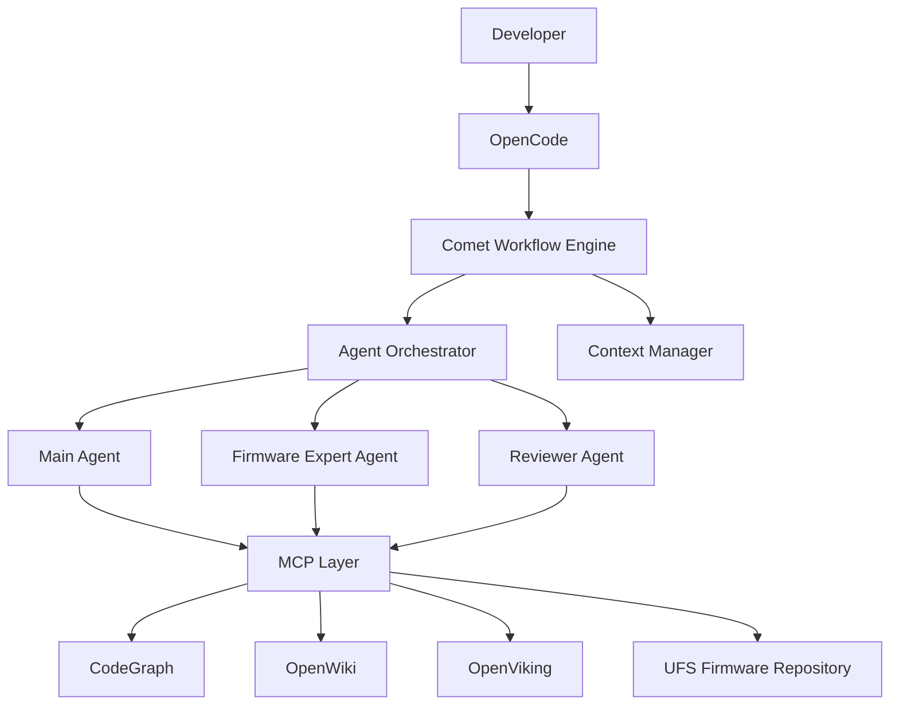

# UFS Firmware AI Agent 辅助开发系统架构方案总结

版本：V1.0

## 1. 项目背景与目标

### 1.1 背景

传统 UFS Firmware 开发存在：
- 代码规模大
- 模块耦合复杂
- 历史设计原因隐藏
- 关键经验依赖资深工程师
- 新 Feature 理解成本高

AI Coding 工具可以辅助写代码，但无法很好解决：
- 为什么这里这样设计？
- 修改这个地方是否会破坏已有稳定性？

因此需要构建一个具备工程理解能力的 AI Agent 系统。

### 1.2 总体目标

构建 AI Firmware Engineering System，而不是简单 AI Coding Assistant。

目标：
1. AI 理解整个 Firmware 架构；
2. AI 能够主动发现知识缺口；
3. AI 能够调用领域专家 Agent；
4. AI 能够完成设计、实现、Review；
5. AI 能够沉淀工程经验。

---

## 2. 总体系统架构



---

## 3. 核心组件职责

### 3.1 Comet

定位：Workflow 控制中心。

负责：
- 流程编排
- 状态管理
- Artifact 管理
- Event 驱动
- Human Gate

不负责：
- 代码理解
- 技术分析

### 3.2 OpenCode

定位：Agent Runtime。

负责：
- Agent 执行
- Skill 加载
- Plugin 扩展
- Hook 执行
- MCP 调用

### 3.3 Skill

定义 Agent 如何完成任务。

例如：
- feature-analysis
- firmware-design
- code-review

包含：
- Prompt
- 流程
- 输出格式
- 检查列表

### 3.4 Plugin

定义 Agent 具备什么能力。

建议：
```text
ufs-ai-plugin/
  agents/
  skills/
  hooks/
  tools/
  context/
  router/
```

### 3.5 Hook

定义什么时候自动介入。

例如：
- 发现未知问题
- 修改高风险文件
- Artifact 生成
- Review 失败

### 3.6 MCP

定义 Agent 访问外部能力。

例如：
- CodeGraph MCP
- OpenWiki MCP
- OpenViking MCP
- Compiler MCP
- Git MCP

---

## 4. Agent 体系设计

### 4.1 Main Agent

角色：Firmware Developer

职责：
- 理解需求
- 分析代码
- 生成设计
- 修改代码

权限：
```text
read code
write code
call tools
```

### 4.2 Firmware Expert Agent

角色：资深 UFS Firmware Architect。

职责：
- 解决技术疑问
- 分析设计意图
- 判断风险
- 查询历史经验

权限：
```text
read code
CodeGraph
OpenWiki
OpenViking
```

原则：
```text
禁止直接修改代码
```

### 4.3 Reviewer Agent

职责：设计审查。

检查：
- 完整性
- 风险
- 接口影响
- 测试覆盖

注意：这里的 Reviewer Agent 首要职责是审查 Comet 流程产生的设计/分析等文档，不等同于传统 Code Review。

---

## 5. Main Agent 如何发现自己不知道？

不能依赖“Agent 主动说不知道”。

采用 Knowledge Gap Detection。

流程：

```text
Main Agent
    |
analysis.md
    |
unknowns.yaml
    |
Hook 检测
    |
Expert 调用
```

示例：

```yaml
question: "Why threshold is 75%?"
category: "design_reason"
confidence: 0.35
risk: "high"
```

---

## 6. Firmware Expert 调用流程

完整链路：

```text
Main Agent
  |
  | 发现知识缺口
  v
OpenCode Hook
  |
  v
Comet Event
  |
  v
Agent Orchestrator
  |
  v
Firmware Expert
  |
  +--> CodeGraph
  +--> OpenWiki
  +--> OpenViking
  |
  v
expert-answer.md
  |
  v
Main Agent 继续
```

核心思想：

Main Agent 不需要直接“聊天式调用”专家，而是产生结构化 Knowledge Gap Event，由 Orchestrator 调度专家。

---

## 7. Agent Orchestrator

定位：Comet Workflow 与 OpenCode Agent Runtime 之间的调度中心。

职责：
- Agent 注册
- Agent 能力发现
- 专家选择
- 上下文注入
- Agent 生命周期管理
- 任务恢复
- 多专家并行

### 7.1 Agent Registry

保存：
- Agent 名称
- Agent 类型
- 能力
- 模型
- 工具权限

### 7.2 Expert Router

根据问题选择专家：

```text
GC / FTL 问题       -> FTL Expert
Power / Hibern8     -> Power Expert
Assert / Crash      -> Debug Expert
Performance         -> Performance Expert
```

第一阶段可使用规则路由，后期再引入 LLM 分类。

### 7.3 Context Builder

为不同 Agent 构建不同上下文。

Main Agent：
```text
requirement.md
architecture.md
code-map
```

Expert：
```text
question.yaml
related-code
history
```

Reviewer：
```text
design.md
expert-answer.md
```

---

## 8. Knowledge Plane

三个知识系统不是简单并列，而是有明确分工。

### 8.1 CodeGraph：代码事实

回答：
- 哪里定义？
- 谁调用？
- 数据怎么流？
- 修改影响范围？

### 8.2 OpenWiki：正式规范

保存：
- Firmware Architecture
- Interface Spec
- Coding Rule
- Design Rule
- Test Guide

回答：
- 应该是什么样？
- 接口有什么要求？
- 设计规范是什么？

### 8.3 OpenViking：工程经验

保存：
- ADR
- Bug
- Review Comment
- Lesson Learned
- 历史设计原因

回答：
- 为什么这么做？
- 以前为什么不能这样改？
- 有没有历史坑？

---

## 9. Knowledge Router

不建议所有问题同时搜索所有知识库。

建议：

```text
Question
   |
Knowledge Classifier / Router
   |
   +-- Structure ------> CodeGraph
   |
   +-- Specification --> OpenWiki
   |
   +-- Experience -----> OpenViking
```

必要时允许一个问题同时查询多个知识源。

---

## 10. Context 管理

不要让 Agent 之间共享完整聊天记录。

采用：

```text
Artifact + Context
```

每个 Feature 建立独立上下文：

```text
Feature Context
├── requirement.md
├── analysis.md
├── code-map.json
├── expert-answer.md
├── design.md
├── review.md
└── test-report.md
```

不同 Agent 只加载自己需要的上下文，降低 Token 消耗并提高可审计性。

---

## 11. Comet Workflow

建议 Workflow 采用状态机。

```text
Requirement
   ↓
Analysis
   ↓
Knowledge Gap / Expert Consultation
   ↓
Design
   ↓
Design Review
   ↓
Implementation
   ↓
Code Review
   ↓
Verification
   ↓
Knowledge Update
```

Stage 状态可以包括：

```text
INIT
RUNNING
WAITING_EXPERT
WAITING_HUMAN
REVIEWING
PASSED
FAILED
REWORK
```

### 11.1 Artifact 是流程状态载体

例如：

```json
{
  "artifact": "design.md",
  "status": "review_passed"
}
```

Workflow 根据 Artifact 状态推进。

### 11.2 Human Gate

对于真正需要人工决策的节点：

```text
WAITING_HUMAN
    |
    +--> APPROVED --> NEXT
    |
    +--> REWORK ----> PREVIOUS STAGE
```

加入 Agent 后，很多低价值人工决策可以自动化，但架构性、高风险决策仍建议保留 Human Gate。

---

## 12. Artifact 设计

每个 Feature：

```text
feature_xxx/
├── 00_requirement/
│   └── requirement.md
├── 01_analysis/
│   ├── code-map.json
│   └── impact.md
├── 02_expert/
│   └── expert-answer.md
├── 03_design/
│   ├── design.md
│   └── ADR.md
├── 04_code/
│   └── patch
├── 05_review/
│   └── review.md
├── 06_test/
│   └── report.md
└── 07_knowledge/
    └── lesson.md
```

---

## 13. OpenCode Plugin 组织

建议：

```text
ufs-ai-plugin/
├── agents/
│   ├── main-developer.yaml
│   ├── firmware-expert.yaml
│   └── design-reviewer.yaml
├── skills/
│   ├── feature-analysis/
│   ├── firmware-design/
│   └── code-review/
├── hooks/
│   ├── knowledge-gap.py
│   ├── risk-check.py
│   └── artifact-review.py
├── tools/
├── context/
└── router/
```

### Main Agent 示例

```yaml
agent:
  name: main-developer
  role: firmware developer
  description: Responsible for implementing UFS firmware features
  model: qwen-27b
  skills:
    - feature-analysis
    - firmware-design
    - coding
  tools:
    - codegraph
    - git
    - compiler
  permissions:
    write_code: true
```

### Firmware Expert 示例

```yaml
agent:
  name: firmware-expert
  role: senior ufs firmware architect
  model: qwen-large
  skills:
    - architecture-analysis
    - root-cause-analysis
  tools:
    - codegraph
    - openwiki
    - openviking
  permissions:
    write_code: false
```

### Reviewer 示例

```yaml
agent:
  name: design-reviewer
  role: firmware design reviewer
  model: qwen-32b
  skills:
    - design-review
  tools:
    - codegraph
    - openwiki
  permissions:
    write_code: false
```

---

## 14. Hook 设计

### Knowledge Gap Hook

当 Agent 产生：

```text
unknowns.yaml
```

触发：

```text
knowledge-gap-hook
```

产生：

```text
KnowledgeGapDetected
```

然后交给 Comet / Orchestrator。

### Risk Check Hook

当修改高风险模块：

```text
gc.c
power.c
recovery.c
nand.c
```

触发风险检查，可以要求 Expert 介入。

### Artifact Review Hook

当生成：

```text
design.md
analysis.md
```

自动触发 Reviewer。

---

## 15. Agent 间通信

不建议：

```text
Main:
帮我看看这个问题。

Expert:
好的。
```

建议结构化 Task：

```js