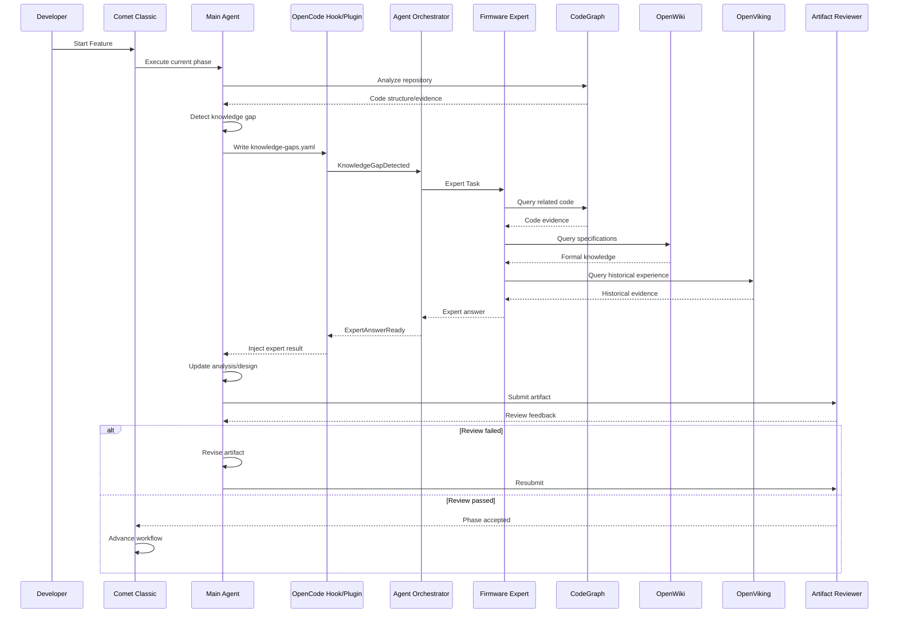

# UFS Firmware AI Agent Engineering System — V2 架构设计规格书

版本：V2.0

---

## 1. 总体架构 V2

### 1.1 架构目标

系统目标不是“让一个 Agent 自动写 UFS Firmware”，而是：

> 让多个具有明确职责的 Agent，在 Comet Classic 工程流程约束下，共同完成一个 UFS Firmware Feature。

整体形成四层：

```text
┌─────────────────────────────────────────────┐
│              Engineering Workflow           │
│                                             │
│                 Comet Classic              │
│                                             │
│ Open → Design → Build → Verify → Archive   │
└──────────────────────┬──────────────────────┘
                       │
┌──────────────────────▼──────────────────────┐
│                Agent Runtime                 │
│                                             │
│                    OpenCode                 │
│                                             │
│ Main / Expert / Reviewer / Extractor        │
└──────────────────────┬──────────────────────┘
                       │
┌──────────────────────▼──────────────────────┐
│              Agent Intelligence Layer        │
│                                             │
│ Plugin / Hook / Skill / Orchestrator        │
└──────────────────────┬──────────────────────┘
                       │
┌──────────────────────▼──────────────────────┐
│                Knowledge Plane               │
│                                             │
│ CodeGraph / OpenWiki / OpenViking / Graphify│
└─────────────────────────────────────────────┘
```

---

## 2. Comet Classic 在系统中的定位

不建议重新实现一个 Workflow Engine。

当前 Comet Classic 已经具备：
- 五阶段流程
- State Machine
- Guard
- 状态持久化
- phase transition
- phase checks
- recovery
- audit event
- auto transition

因此：

> 扩展 Comet，而不是替换 Comet。

### 2.1 Comet Classic 原始流程

```text
/comet-classic
      ↓
/comet-open
      ↓
/comet-design
      ↓
/comet-build
      ↓
/comet-verify
      ↓
/comet-archive
```

| Phase | 核心职责 |
|---|---|
| Open | 需求、Proposal、初步设计 |
| Design | 深度分析、设计 |
| Build | Implementation |
| Verify | 验证 |
| Archive | 归档、规范同步 |

---

## 3. V2 的核心变化

不改变五阶段。

在每个阶段内部增加：

```text
Comet Phase
     │
     ├── Main Agent
     │
     ├── Expert Agent
     │
     ├── Document Reviewer
     │
     └── Knowledge Tools
```

例如：

```text
/comet-design
      │
      ├── Main Agent
      ├── CodeGraph
      ├── OpenWiki
      ├── OpenViking
      ├── Knowledge Gap
      ├── Firmware Expert
      └── Document Reviewer
```

核心原则：

> Comet 决定“现在做什么”；Agent 决定“怎么做”。

---

# 4. Agent 体系 V2

建议正式定义五类 Agent。

```text
                    Agent System
                        │
          ┌─────────────┼─────────────┐
          │             │             │
        Main          Expert       Reviewer
       Agent           Agents       Agents
          │             │             │
          └─────────────┼─────────────┘
                        │
                 Knowledge Extractor
```

---

## 4.1 Main Agent

定位：

> Feature Developer / Primary Agent

职责：
- 理解需求
- 理解代码
- 进行影响分析
- 制定设计
- 修改代码
- 执行测试
- 推进当前 Comet Phase

Main Agent 是整个流程的主要执行者。

---

# 5. Firmware Expert Agent

定位：

> Senior Firmware Architect

它不是第二个 Main Agent，也不是代码生成 Agent，而是：

> 解决 Main Agent 无法可靠解决的专业问题。

### 5.1 Expert 的典型问题

```text
为什么这里必须保留这个 barrier？
为什么这个 timeout 是 100ms？
为什么这个状态只能在 recovery path 修改？
为什么这个 mapping 不能直接更新？
这个 NAND workaround 是针对什么历史问题？
修改这里会不会影响 Hibern8？
```

CodeGraph 更擅长回答“是什么”，Expert 需要进一步解决“为什么”。

Expert 访问：

```text
CodeGraph
OpenWiki
OpenViking
Graphify
```

---

# 6. Expert Agent 的知识访问策略

不要简单采用：

```text
Question
 ↓
RAG
 ↓
Answer
```

而采用：

```text
Question
   ↓
Question Classification
   ↓
Evidence Collection
   ↓
CodeGraph
   ↓
OpenWiki
   ↓
OpenViking
   ↓
Cross Validation
   ↓
Expert Reasoning
   ↓
Answer + Evidence + Confidence
```

---

# 7. Reviewer Agent

必须明确：

> Reviewer Agent 是 Comet 文档/流程产物审查 Agent，不等于 Code Review Agent。

建议正式命名：

```text
Artifact Reviewer
```

而不是简单命名为：

```text
Code Reviewer
```

### 7.1 Reviewer 审查对象

```text
proposal.md
design.md
analysis.md
impact.md
tasks.md
expert-answer.md
implementation-plan.md
verification.md
ADR.md
```

### 7.2 Reviewer 检查内容

例如 Design 阶段：

```text
需求是否理解正确？
影响范围是否完整？
是否遗漏模块？
专家意见是否正确引用？
是否存在未经验证的假设？
是否考虑 backward compatibility？
是否考虑 error path？
是否考虑 power/recovery path？
测试方案是否覆盖风险？
```

---

# 8. Knowledge Extractor Agent

定位：

> Feature 完成后的知识沉淀 Agent。

输入：

```text
proposal
design
expert-answer
review
code diff
test report
bug
```

输出：

```text
ADR
Lesson Learned
Design Pattern
Bug Knowledge
Review Pattern
```

最终进入 OpenViking。

---

# 9. Expert Agent 的能力配置

Firmware Expert 的能力不能只靠 Prompt。

采用：

```text
Expert Agent
=
Role
+
System Prompt
+
Skills
+
Tools
+
Knowledge Sources
+
Output Schema
+
Permissions
```

### 9.1 Role

```text
Senior UFS Firmware Architect
```

### 9.2 Skill

```text
ufs-architecture
ufs-power-management
ufs-ftl
ufs-nand
ufs-debug
ufs-performance
```

### 9.3 Tools

```text
CodeGraph
OpenWiki
OpenViking
Graphify
Git
Compiler
```

### 9.4 权限

```text
READ CODE       ✓
QUERY KNOWLEDGE ✓
RUN ANALYSIS    ✓
WRITE CODE      ✗
```

---

# 10. Knowledge Gap：最关键的设计

不能要求 Main Agent 每次都主动决定“我要找 Expert”。

建立：

> Knowledge Gap Protocol

---

# 11. Knowledge Gap Protocol

Main Agent 在分析过程中维护：

```text
knowledge-gaps.yaml
```

示例：

```yaml
gaps:

  - id: GAP-001

    question:
      "Why is gc_threshold set to 75%?"

    category:
      design_reason

    confidence:
      0.35

    risk:
      high

    blocking:
      true
```

---

# 12. Gap 分类

```text
STRUCTURE
SPECIFICATION
DESIGN_REASON
HISTORICAL
RISK
PERFORMANCE
PROTOCOL
HARDWARE
UNKNOWN
```

例如：

```text
“谁调用这个函数？”
→ STRUCTURE

“这个接口要求是什么？”
→ SPECIFICATION

“为什么这么设计？”
→ DESIGN_REASON

“这个 workaround 是为什么？”
→ HISTORICAL

“修改它有没有风险？”
→ RISK
```

---

# 13. Knowledge Gap 自动触发

```text
Main Agent
     │
     │ writes / updates
     ▼
knowledge-gaps.yaml
     │
     ▼
OpenCode Plugin / Hook
     │
     ▼
KnowledgeGapDetected
     │
     ▼
Expert Router
     │
     ▼
Firmware Expert
```

OpenCode Plugin 作为事件监听、行为拦截和 Agent 调度适配层。

---

# 14. Expert Request Schema

```yaml
request_id: EXP-001

source:
  agent: main
  phase: design

question:
  "Why is gc_threshold 75%?"

category:
  design_reason

risk:
  high

confidence:
  0.35

evidence:

  files:
    - gc.c
    - gc_policy.c

  functions:
    - gc_check_threshold()
    - gc_schedule()

required_output:
  - conclusion
  - evidence
  - risk
  - recommendation
```

---

# 15. Expert Response Schema

```yaml
request_id: EXP-001

status:
  answered

conclusion:
  "75% threshold is intended to protect host latency."

evidence:

  code:
    - gc_policy.c:125

  knowledge:
    - BUG-2023-017

  documents:
    - GC-Design.md

confidence:
  0.91

risk:
  high

recommendation:
  "Do not increase threshold directly."

remaining_unknowns:
  []
```

---

# 16. Expert 无法回答怎么办？

Expert 不能强行回答。

```text
Expert
  ↓
Evidence insufficient
  ↓
status = insufficient_information
  ↓
Main Agent / Human
```

示例：

```yaml
status: insufficient_information

reason:
  "Historical reason cannot be confirmed."

recommended_action:
  human_confirmation
```

---

# 17. 多专家机制

第一阶段：

```text
Firmware Expert
```

架构上预留：

```text
FTL Expert
NAND Expert
Power Expert
Performance Expert
Debug Expert
Protocol Expert
```

---

# 18. Expert Router

```text
Knowledge Gap
     ↓
Classifier
     ↓
+---------+----------+----------+
|         |          |          |
FTL      Power      NAND      Debug
```

第一版使用 Rule-based Router：

```yaml
routes:

  gc:
    - ftl-expert

  hibern8:
    - power-expert

  ecc:
    - nand-expert

  assert:
    - debug-expert
```

后续再增加 LLM Router。

---

# 19. 多专家并行

例如 GC 优化：

```text
               GC Question
                    │
           ┌────────┴────────┐
           │                 │
      FTL Expert       Performance Expert
           │                 │
           └────────┬────────┘
                    ↓
               Synthesis
```

最后由 Main Agent 或专门 Synthesis Agent 形成结论。

---

# 20. OpenCode Plugin V2

当前 OpenCode Plugin 能力适合承担 Agent Intelligence Layer。

推荐：

> 把 Agent Orchestrator 的 OpenCode 侧适配层实现为 Plugin，而不是一开始修改 OpenCode Core。

---

# 21. OpenCode Plugin 结构

```text
.opencode/
│
├── plugins/
│   └── ufs-ai-plugin.ts
│
├── skills/
│   ├── ufs-feature-analysis/
│   │   └── SKILL.md
│   ├── ufs-design/
│   │   └── SKILL.md
│   ├── ufs-build/
│   │   └── SKILL.md
│   └── ufs-review/
│       └── SKILL.md
│
└── package.json
```

Skill 采用按需加载方式，避免所有 Skill 同时进入上下文。

---

# 22. Agent 定义

Agent 和 Skill 分开：

```text
Agent
 ↓
决定“谁”
 ↓
Skill
 ↓
决定“怎么做”
```

例如：

```text
Main Agent
   ↓
ufs-feature-analysis
```

而：

```text
Firmware Expert
   ↓
ufs-root-cause-analysis
```

---

# 23. Hook 体系

至少设计六类 Hook：

```text
1. Workflow Hook
2. Knowledge Gap Hook
3. Artifact Hook
4. Risk Hook
5. Tool Hook
6. Knowledge Extraction Hook
```

---

# 24. Workflow Hook

监听：

```text
Comet phase transition
```

例如：

```text
Open → Design
```

自动：

```text
加载 Design Skill
```

---

# 25. Knowledge Gap Hook

监听：

```text
knowledge-gaps.yaml
```

发现：

```text
blocking=true
```

则：

```text
触发 Expert
```

---

# 26. Artifact Hook

例如：

```text
design.md created
```

自动：

```text
Artifact Reviewer
```

---

# 27. Risk Hook

例如 Main Agent 修改：

```text
recovery.c
power.c
nand.c
gc.c
```

触发：

```text
HighRiskChange
```

然后：

```text
Firmware Expert Review
```

---

# 28. Tool Hook

用于：
- 工具调用审计
- 高风险 Tool 阻断
- 参数检查
- 记录证据

例如：

```text
git reset
rm
flash
hardware test
```

增加安全控制。

---

# 29. Knowledge Extraction Hook

当：

```text
/comet-archive
```

完成时：

```text
Knowledge Extractor
```

形成：

```text
lesson.md
ADR.md
```

进入知识库。

---

# 30. Comet Classic Workflow 增强

原始：

```text
Open
 ↓
Design
 ↓
Build
 ↓
Verify
 ↓
Archive
```

V2：

```text
Open
 │
 ├─ Main Agent
 ├─ Expert
 └─ Artifact Reviewer
 │
 ▼
Design
 │
 ├─ Main Agent
 ├─ Knowledge Gap
 ├─ Expert
 └─ Artifact Reviewer
 │
 ▼
Build
 │
 ├─ Main Agent
 ├─ Risk Hook
 └─ Expert
 │
 ▼
Verify
 │
 ├─ Main Agent
 ├─ Reviewer
 └─ Expert
 │
 ▼
Archive
 │
 └─ Knowledge Extractor
```

---

# 31. Comet DSL 增强原则

不建议重新创造完整 DSL。

采用：

```text
Comet 原生状态
+
UFS AI 配置
```

示例：

```yaml
ufs_ai:

  agents:
    main: main-developer
    expert: firmware-expert
    reviewer: artifact-reviewer

  knowledge:
    codegraph: true
    openwiki: true
    openviking: true

  expert:
    auto_trigger: true

  review:
    document_review: true
```

---

# 32. Artifact Review Loop

```text
Main Agent
   ↓
design.md
   ↓
Artifact Reviewer
   ↓
FAIL
   ↓
review-feedback.md
   ↓
Main Agent
   ↓
修改 design.md
   ↓
Reviewer
   ↓
PASS
   ↓
Comet继续
```

核心目标：

> 审查不通过 → 反馈给主 Agent → 主 Agent 修改 → 再审查。

这里不涉及 Code Review。

---

# 33. Reviewer 输出

```yaml
status: failed

findings:

  - id: R001
    severity: high
    category: missing-impact-analysis
    description: >
      Power recovery path was not considered.
    evidence:
      - power.c
    required_action: >
      Analyze recovery interaction.

  - id: R002
    severity: medium
    category: test-gap
    description: >
      No Hibern8 regression test.
```

Main Agent 必须处理 R001/R002。

---

# 34. Review 闭环

```text
Artifact
   ↓
Review
   ↓
PASS ─────────→ Next Phase
   │
FAIL
   ↓
Feedback
   ↓
Main Agent
   ↓
Artifact Revision
   ↓
Review
```

增加：

```text
max_iterations
```

避免无限循环。

---

# 35. Knowledge Plane V2

```text
                   Knowledge Plane
                         │
        ┌────────────────┼────────────────┐
        │                │                │
    Code Fact        Formal Rule      Experience
        │                │                │
    CodeGraph         OpenWiki       OpenViking
        │                │                │
        └────────────────┼────────────────┘
                         │
                   Knowledge Router
```

Graphify 作为知识/代码关系可视化和辅助探索层，而不是替代 CodeGraph / OpenWiki / OpenViking。

---

# 36. POC 工程目录 V2

```text
ufs-ai-engineering/
│
├── .comet/
│
├── .opencode/
│   ├── plugins/
│   │   └── ufs-ai-plugin.ts
│   ├── skills/
│   │   ├── ufs-open/
│   │   ├── ufs-design/
│   │   ├── ufs-build/
│   │   ├── ufs-verify/
│   │   ├── ufs-expert/
│   │   └── ufs-review/
│   └── package.json
│
├── ai/
│   ├── agents/
│   ├── router/
│   ├── context/
│   ├── schemas/
│   └── prompts/
│
├── docs/
│   └── ai/
│
├── knowledge/
│   ├── architecture/
│   ├── decisions/
│   ├── bugs/
│   └── lessons/
│
└── firmware/
    └── <UFS firmware repository>
```

---

# 37. 运行时序图



---

# 38. 是否修改 Comet 源码？

采用三级策略。

## Level 0：不修改

优先：

```text
Comet Classic
+
OpenCode Plugin
+
OpenCode Hook
+
MCP
+
Skill
```

这是 POC 首选。

## Level 1：Plugin/Script 扩展

如果发现：
- Expert 调用不方便
- Artifact Review 无法自动回流
- Event 不足

优先增加：

```text
Comet Plugin / Script
```

而不是直接修改核心。

## Level 2：修改 Comet Core

当确定需要：

```text
Native Agent Task
Native Event
Native Artifact Review
Native Expert Delegation
```

再修改 Comet。

尤其值得修改：

### Agent Task API

```text
createAgentTask()
getAgentTask()
resumeAgentTask()
```

### Workflow Event API

```text
emit()
subscribe()
wait()
```

### Artifact Review API

```text
submitReview()
reviewPassed()
reviewFailed()
```

### Expert Delegation

```text
delegateExpert()
```

---

# 39. 是否修改 OpenCode？

目前：

> 不建议第一阶段修改。

优先：

```text
OpenCode Core
      ↓
尽量不改

OpenCode Plugin
      ↓
实现智能层
```

---

# 40. 什么时候值得修改 OpenCode？

只有当：

```text
Plugin API 无法实现
        ↓
必须修改 Runtime
```

例如：
- 原生 Agent delegation 不足
- 无法可靠创建子 Session
- Context 生命周期无法控制
- Workflow 级 Agent 状态无法获取
- Plugin 无法实现必要隔离机制

否则：

> Plugin 优先。

---

# 41. POC V2 实施计划

## Phase 0：基础环境

```text
OpenCode
Comet Classic
CodeGraph
```

跑通。

## Phase 1：Main Agent

实现：

```text
/comet-open
/comet-design
```

让 Main Agent 使用：

```text
CodeGraph
OpenWiki
```

## Phase 2：Firmware Expert

实现：

```text
firmware-expert
```

接入：

```text
CodeGraph
OpenWiki
OpenViking
```

## Phase 3：Knowledge Gap

实现：

```text
knowledge-gaps.yaml
+
Hook
+
Expert Router
```

跑通：

```text
Main → Expert → Main
```

## Phase 4：Artifact Reviewer

实现：

```text
Artifact
 ↓
Reviewer
 ↓
FAIL
 ↓
Main
 ↓
Reviewer
```

## Phase 5：Comet Integration

把能力嵌入：

```text
Open
Design
Build
Verify
Archive
```

## Phase 6：Knowledge Evolution

Archive 阶段：

```text
Knowledge Extractor
       ↓
Knowledge Reviewer
       ↓
OpenViking
```

---

# 42. 最终 V2 架构

```text
                         Developer
                             │
                             ▼
                    ┌─────────────────┐
                    │  Comet Classic  │
                    │                 │
                    │ Open            │
                    │ Design          │
                    │ Build           │
                    │ Verify          │
                    │ Archive         │
                    └────────┬────────┘
                             │
                             ▼
                    ┌─────────────────┐
                    │    OpenCode     │
                    │  Agent Runtime  │
                    └────────┬────────┘
                             │
              ┌──────────────┼──────────────┐
              ▼              ▼              ▼
           Main           Expert         Reviewer
           Agent           Agents          Agent
              │              │              │
              └──────────────┼──────────────┘
                             │
                    ┌────────▼────────┐
                    │ UFS AI Plugin   │
                    │                 │
                    │ Orchestrator    │
                    │ Context         │
                    │ Router          │
                    │ Hooks           │
                    └────────┬────────┘
                             │
                     ┌───────▼───────┐
                     │     MCP       │
                     └───────┬───────┘
                             │
          ┌──────────────────┼──────────────────┐
          ▼                  ▼                  ▼
      CodeGraph          OpenWiki          OpenViking
          │                  │                  │
       Code Fact         Formal Rule       Experience
          │                  │                  │
          └──────────────────┼──────────────────┘
                             ▼
                       UFS Firmware
```

---

# 43. V2 最核心的五条原则

### 原则一

**Comet 负责流程，不让 Agent 自己决定整个流程。**

### 原则二

**OpenCode 负责 Agent 执行，充分利用 Plugin 和 Hook，不急于修改 Core。**

### 原则三

**Main Agent 负责执行，Firmware Expert 负责解决专业知识缺口。**

### 原则四

**Reviewer 审查 Workflow Artifact，不把 Document Review 和 Code Review 混为一谈。**

### 原则五

**CodeGraph、OpenWiki、OpenViking 分别承担代码事实、正式规范、工程经验。**

---

# 44. V2 与 V1 相比最大的变化

V1：

```text
Comet
 +
Main Agent
 +
Expert Agent
 +
Knowledge
```

V2：

```text
Comet Classic
      │
      ▼
OpenCode Runtime
      │
      ▼
Plugin / Hook Intelligence Layer
      │
      ├── Main Agent
      ├── Expert Router
      ├── Firmware Expert
      ├── Artifact Reviewer
      └── Knowledge Extractor
      │
      ▼
Knowledge Plane
      │
      ├── CodeGraph
      ├── OpenWiki
      └── OpenViking
```

也就是说，我们已经从：

> “增加几个 Agent”

升级成：

> “在 Comet Classic 上建立一个 Firmware AI Engineering Control Plane。”

---

# 45. V2 当前阶段最值得优先验证的闭环

下一阶段不应继续泛化架构，而应该优先把下面这条链路做成真实 POC：

```text
Main Agent
    ↓
CodeGraph / OpenWiki / OpenViking
    ↓
发现 Knowledge Gap
    ↓
OpenCode Hook
    ↓
Expert Router
    ↓
Firmware Expert
    ↓
专家搜索知识库
    ↓
Expert Answer
    ↓
Main Agent继续
    ↓
生成 Design Artifact
    ↓
Artifact Reviewer
    ↓
FAIL → Main Agent 修改 → Reviewer
    ↓
PASS
    ↓
Comet 下一阶段
```

这条链路如果跑通，整个方案的核心价值就已经得到验证。

---

# 46. V2 最终设计思想

整个系统的核心不是：

```text
AI + Code Generation
```

而是：

```text
AI
+
Workflow
+
Engineering Methodology
+
Expert Delegation
+
Code Knowledge
+
Formal Knowledge
+
Engineering Experience
+
Review
+
Knowledge Evolution
```

最终形成：

> 面向 UFS Firmware 的 AI Engineering System。

目标不是完全取消人工，而是：

```text
低价值人工决策
        ↓
自动化

复杂技术问题
        ↓
Firmware Expert

高风险架构决策
        ↓
Human Gate

开发经验
        ↓
Knowledge Base

下一次开发
        ↓
AI 更强
```

最终形成持续进化闭环：

```text
Feature
  ↓
AI Analysis
  ↓
Expert Consultation
  ↓
Design
  ↓
Review
  ↓
Implementation
  ↓
Verification
  ↓
Knowledge Extraction
  ↓
Knowledge Base
  ↓
下一 Feature
```
