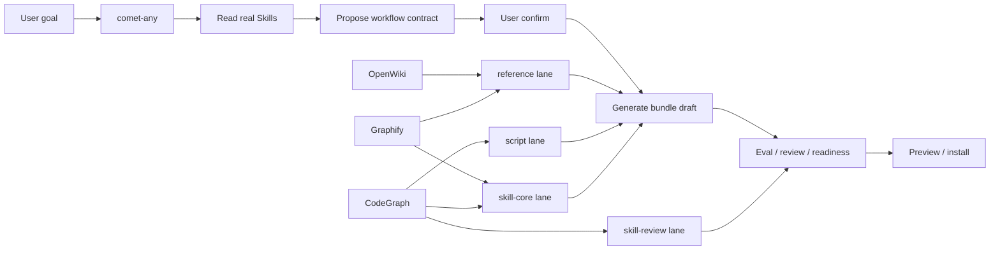

# comet-any 功能说明

> 目的：把 `comet-any` 在 Comet 体系里的职责、输入、产物、边界理清，方便人读，也方便后续给 Comet 流程引用。

## 一句话

`comet-any` 是 Comet 的 Skill 创作器。
它不直接做业务 feature，而是把“用户想要的工作流”转成可验证、可安装、可评审的 Comet-native Skill Bundle。

## 它解决什么

- 把用户目标翻译成 workflow 结构
- 把节点职责和 Skill 绑定起来
- 把必须调用的 Skill 变成硬约束
- 把节点输出变成 evidence / schema
- 把创作过程拆成可审查、可恢复的 lane
- 把最终结果跑过 eval、review、readiness、preview

## 它不做什么

- 不替代 `/comet` 主流程
- 不直接实现业务代码
- 不把 `.comet/runs/...` 当主状态
- 不在用户确认前直接写 Bundle draft
- 不在缺少真实 Skill / evidence 时强行 ready

## 用户能选的 3 类起点

1. 基于现有 Comet 五阶段做定制
2. 创建全新 workflow Skill
3. 整理已有 Skill

## 核心模型

`comet-any` 最终都要落到同一组抽象上：

- `Workflow Node`：流程节点，如 `open`、`design`、`plan`、`execute`、`review`、`verify`、`archive`
- `Node Responsibility`：节点职责，解释为什么存在、负责什么
- `Skill Binding`：节点绑定的实现 Skill 或辅助 Skill
- `Required Skill Call`：节点内必须调用的 Skill，不能被实现替换掉
- `Output Schema`：节点必须产出的文件、状态或 evidence
- `Guardrail`：阻断或放行节点推进的检查
- `Handoff`：子代理或跨节点交接必须带回的证据
- `workflow-protocol.json`：运行事实源

## 典型流程

### 1. 恢复状态

先读项目当前状态，确认用户是不是在恢复已有 workflow。

### 2. 发现真实 Skill

读取项目偏好，再找真实可用 Skill，避免只靠名字猜能力。

### 3. 生成方案

把用户目标写成：

- workflow kind
- nodes
- responsibilities
- bindings
- required skill calls
- output schemas
- guardrails
- handoffs

### 4. 展示确认页

确认页要让用户看清：

- 每个节点干什么
- 用哪个 Skill
- 哪些是硬约束
- 哪些输出会进入 evidence
- 哪些地方会阻断推进

### 5. 等待确认

未确认前，不写 Bundle draft。

### 6. 初始化创作状态

确认后，生成 plan / protocol / lanes / draft artifacts。

### 7. 创作与审查

按 lane 产出：

- script
- reference
- pause-points
- workflow-entry
- skill-core
- skill-review

### 8. Eval 和 readiness

对 draft hash 做 eval evidence。
只有当前 hash 的证据才算数。

### 9. 发布预览

先 preview，再 publish。
preview 必须展示 `No files were written` 之类的结果说明。

## 受保护边界

对 `comet-five-phase-overlay`，`comet-any` 必须尊重：

- `open / execute / verify / archive` 这些 control node
- `.comet.yaml` 作为主状态
- 没有 active change 或多个 active change 时阻塞
- control node 普通模式不能 override

## 产物

`comet-any` 主要生成这些东西：

- entry `SKILL.md`
- internal node skills
- `reference/workflow-protocol.json`
- `reference/resolved-skills.json`
- `reference/decision-points.md`
- `reference/recovery.md`
- `reference/authoring-lanes.json`
- `reference/skill-review.md`
- scripts / rules / hooks
- `comet/eval.yaml`

## 对人类的价值

- 不用手工拼 workflow
- 不用凭感觉选 Skill
- 不用猜输出是否算合规
- 不用靠聊天记录记住流程

## 对 Comet 流程的价值

- 让流程可恢复
- 让节点职责可审查
- 让证据和实现分离
- 让 eval / review / readiness 有共同事实源

## 3 个工具在 comet-any 里的位置

### OpenWiki

最适合放在 `reference` lane。

原因：

- 它产出的是长期知识和项目约定
- 它更像证据底座，不是实时结构分析
- `reference` lane 正好负责把真实来源整理成可审计证据

在 `comet-any` 里可用于：

- 项目背景总结
- 术语表
- 目录约定
- 历史决策
- 用户可见流程说明

### Graphify

最适合放在 `reference` 和 `skill-core` 之间。

原因：

- 它擅长把仓库结构、文档、图示、媒体关系整理成 graph
- `reference` lane 需要全局证据
- `skill-core` lane 需要把结构关系翻成可执行的节点职责

在 `comet-any` 里可用于：

- 识别模块之间的关系
- 找跨文件依赖
- 解释设计为什么要这么拆
- 给 review lane 提供全局结构证据

### CodeGraph

最适合放在 `script`、`skill-core`、`skill-review` 三处。

原因：

- 它偏代码级结构真相
- `script` lane 需要知道如何恢复、如何判断完成
- `skill-core` lane 需要把调用链、路由、符号边界写进节点职责
- `skill-review` lane 需要检查改动影响面和证据链

在 `comet-any` 里可用于：

- 定位符号
- 追调用链
- 看路由和 handler
- 确认变更影响面
- 校验测试范围

## UFS 固件仓库版映射

如果目标仓库是 UFS 固件代码库，这 3 个工具建议这样用：

### OpenWiki

优先沉淀这些内容：

- 启动流程
- 固件层次结构
- 模块边界
- 平台差异
- 构建约定
- 常见故障模式
- 回归测试入口

适合回答的问题：

- 这块代码属于 boot / driver / protocol / test 哪层
- 哪些目录不能随便改
- 哪些平台差异是显式约束，不是 bug

### Graphify

优先建立这些关系：

- 启动链路
- 配置链路
- 数据流
- 命令处理链路
- 错误传播链路
- 文档与代码的对应关系

适合回答的问题：

- 这个 feature 会不会影响启动路径
- 哪些模块一起变
- 哪些文档和代码说明要同步

### CodeGraph

优先锁这些代码结构：

- 核心符号
- 调用链
- 配置入口
- 条件编译分支
- 测试挂钩
- 失败路径

适合回答的问题：

- 改这个函数会影响哪几条路径
- 这个宏开关覆盖哪些逻辑
- 哪些测试必须补
- 哪些路径是回归高风险区

## 流程图



### 读法

- `OpenWiki` 先喂给 `reference lane`
- `Graphify` 同时喂 `reference lane` 和 `skill-core lane`
- `CodeGraph` 同时喂 `script lane`、`skill-core lane`、`skill-review lane`
- `comet-any` 最终把这三路证据合成 bundle draft

### 这张图表达的重点

- `comet-any` 是编排器，不是知识源
- 三个工具分别补不同层
- 证据先进入 lane，再进入 bundle
- 最后再过 eval / review / preview

## 简化理解

- `comet` = 做项目
- `comet-any` = 造做项目的 Skill
- `OpenWiki / Graphify / CodeGraph` = 给这个 Skill 提供知识和结构证据

## 可直接给 comet-any 的短提示

```text
目标：为 UFS 固件仓库定制 comet-any 参考。
要求：
1. 说明 comet-any 的职责、输入、产物、边界。
2. 把 OpenWiki / Graphify / CodeGraph 分别映射到 comet-any 的 lane/node。
3. 语言面向固件代码仓库，重点强调启动链路、模块边界、条件编译、配置入口、测试回归。
4. 输出要能给人读，也能给 comet-any 作为 reference。
```
